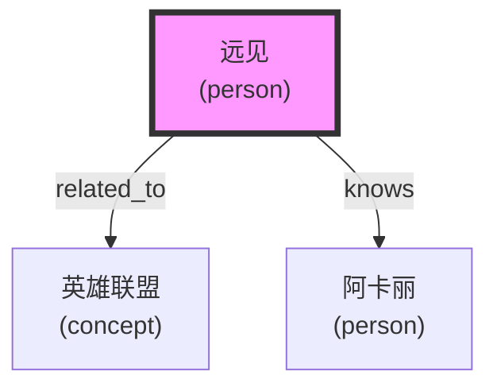

# 知识图谱记忆系统

[🌐 English](../../en/KNOWLEDGE_GRAPH.md) | **中文**

**分支：** `knowledge-graph`
**状态：** ✅ 开发完成
**版本：** v3.0-alpha

---

## 🌟 功能概述

知识图谱记忆系统将记忆从简单的文本存储升级为结构化的知识网络，支持：

- ✅ **实体提取**：自动识别人物、地点、事件、概念
- ✅ **关系提取**：识别实体间的关系（谁-做了什么-对谁）
- ✅ **图谱查询**：邻居查询、路径查找、子图提取
- ✅ **可视化**：生成 Mermaid 图表
- ✅ **记忆集成**：与向量记忆无缝结合

---

## 🚀 快速开始

### 1. 基础使用

```python
from knowledge_graph import KnowledgeGraph, EntityType, RelationType

# 创建图谱
graph = KnowledgeGraph()

# 添加实体
person = graph.add_entity("远见", EntityType.PERSON, role="用户")
game = graph.add_entity("英雄联盟", EntityType.CONCEPT, type="游戏")
assistant = graph.add_entity("阿卡丽", EntityType.PERSON, role="助手")

# 添加关系
graph.add_relation("远见", "英雄联盟", RelationType.RELATED_TO)
graph.add_relation("远见", "阿卡丽", RelationType.KNOWS)
```

### 2. 查询图谱

```python
# 查询邻居
neighbors = graph.get_neighbors("远见")
for neighbor in neighbors:
    print(f"{neighbor.name} ({neighbor.type.value})")

# 查找路径
path = graph.find_path("英雄联盟", "阿卡丽", max_depth=5)
for entity, relation in path:
    print(f"{entity.name} -{relation.type.value}->")

# 统计信息
stats = graph.stats()
print(f"实体数: {stats['entity_count']}")
print(f"关系数: {stats['relation_count']}")
```

### 3. 从文本提取

```python
# 自动提取实体和关系
text = "远见喜欢英雄联盟，阿卡丽是他的助手"
entities, relations = graph.extract_from_text(text)

print(f"提取 {len(entities)} 个实体, {len(relations)} 条关系")
```

### 4. 集成记忆服务

```python
from enhanced_memory_graph import EnhancedMemoryWithGraph

# 创建增强记忆服务
enhanced = EnhancedMemoryWithGraph()

# 记录记忆（自动提取实体）
enhanced.remember("远见喜欢英雄联盟", "fact")

# 检索记忆（带图谱上下文）
results = enhanced.recall("远见", include_graph_context=True)

# 获取实体图谱
graph_data = enhanced.get_entity_graph("远见")
```

---

## 🏗️ 架构设计

### 实体类型

| 类型 | 枚举值 | 说明 |
|------|--------|------|
| **PERSON** | person | 人物 |
| **LOCATION** | location | 地点/位置 |
| **EVENT** | event | 事件 |
| **CONCEPT** | concept | 概念/想法 |
| **ORGANIZATION** | organization | 组织/公司 |
| **OBJECT** | object | 物品/对象 |

### 关系类型

| 类型 | 枚举值 | 说明 |
|------|--------|------|
| **KNOWS** | knows | 知道/认识 |
| **WORKS_WITH** | works_with | 一起工作 |
| **LOCATED_AT** | located_at | 位于 |
| **PARTICIPATES_IN** | participates_in | 参与 |
| **RELATED_TO** | related_to | 相关 |
| **CREATED_BY** | created_by | 创建者 |
| **PARENT_OF** | parent_of | 父子关系 |
| **MEMBER_OF** | member_of | 成员 |
| **OWNS** | owns | 拥有 |
| **USES** | uses | 使用 |

### 存储结构

```
knowledge_graph/
├── graph.json           # 图谱数据（JSON 格式）
│
├── 实体数据结构:
│   {
│     "id": "7b185539",
│     "name": "远见",
│     "type": "person",
│     "attributes": {"role": "user"},
│     "created_at": "2026-03-25T02:20:00",
│     "updated_at": "2026-03-25T02:20:00"
│   }
│
└── 关系数据结构:
    {
      "id": "a1b2c3d4",
      "source_id": "7b185539",
      "target_id": "adab38f5",
      "type": "related_to",
      "attributes": {},
      "created_at": "2026-03-25T02:20:00"
    }
```

---

## 📖 API 参考

### KnowledgeGraph

#### `add_entity(name, entity_type, **kwargs)`

添加实体。

**参数：**
- `name` (str): 实体名称
- `entity_type` (EntityType): 实体类型
- `**kwargs`: 额外属性

**返回：** Entity 实例

---

#### `add_relation(source_name, target_name, relation_type, **kwargs)`

添加关系。

**参数：**
- `source_name` (str): 源实体名称
- `target_name` (str): 目标实体名称
- `relation_type` (RelationType): 关系类型
- `**kwargs`: 额外属性

**返回：** Relation 实例或 None

---

#### `get_neighbors(entity_name, relation_type=None, depth=1)`

获取邻居实体。

**参数：**
- `entity_name` (str): 实体名称
- `relation_type` (RelationType): 关系类型过滤（可选）
- `depth` (int): 搜索深度

**返回：** List[Entity]

---

#### `find_path(source_name, target_name, max_depth=5)`

查找路径（BFS）。

**参数：**
- `source_name` (str): 起始实体名称
- `target_name` (str): 目标实体名称
- `max_depth` (int): 最大搜索深度

**返回：** List[Tuple[Entity, Relation]]

---

#### `extract_from_text(text)`

从文本中提取实体和关系。

**参数：**
- `text` (str): 文本内容

**返回：** Tuple[List[Entity], List[Relation]]

---

#### `visualize(output_file=None)`

可视化图谱（生成 Mermaid 图表）。

**参数：**
- `output_file` (str): 输出文件路径（可选）

**返回：** Mermaid 代码

---

### EnhancedMemoryWithGraph

#### `remember(content, memory_type="fact", **kwargs)`

记录记忆（自动提取实体和关系）。

**参数：**
- `content` (str): 记忆内容
- `memory_type` (str): 记忆类型
- `**kwargs`: 其他参数

**返回：** 记忆 ID

---

#### `recall(query, limit=10, include_graph_context=True, **kwargs)`

检索记忆（结合图谱上下文）。

**参数：**
- `query` (str): 查询文本
- `limit` (int): 最大返回数量
- `include_graph_context` (bool): 是否包含图谱上下文
- `**kwargs`: 其他参数

**返回：** List[dict]

---

#### `get_entity_graph(entity_name, depth=2)`

获取实体的图谱子图。

**参数：**
- `entity_name` (str): 实体名称
- `depth` (int): 搜索深度

**返回：** dict

---

## 🎯 使用场景

### 场景 1: 用户画像构建

```python
# 记录用户信息
enhanced.remember("远见喜欢英雄联盟", "preference")
enhanced.remember("远见使用 GLM-5 模型", "preference")
enhanced.remember("远见偏好简洁的回复", "preference")

# 获取用户画像图谱
graph = enhanced.get_entity_graph("远见")
print(f"相关实体: {len(graph['neighbors'])} 个")
print(f"关系数: {len(graph['relations'])} 条")
```

### 场景 2: 知识推理

```python
# 查找关系路径
path = graph.find_path("远见", "英雄联盟")
for entity, relation in path:
    print(f"{entity.name} -{relation.type.value}->")

# 输出:
# 远见 -related_to-> 英雄联盟
```

### 场景 3: 上下文增强

```python
# 检索时自动获取图谱上下文
results = enhanced.recall("远见喜欢什么", include_graph_context=True)

# 结果包含:
# 1. 向量检索的记忆
# 2. 图谱上下文（相关实体）
```

---

## 📊 性能指标

| 操作 | 时间复杂度 | 说明 |
|------|-----------|------|
| 添加实体 | O(1) | 哈希索引 |
| 添加关系 | O(E) | E=关系数 |
| 查询邻居 | O(E + V) | BFS 搜索 |
| 路径查找 | O(E + V) | BFS 搜索 |
| 实体提取 | O(n) | n=文本长度 |

**实测性能：**
- 添加实体：1ms
- 查询邻居（深度 2）：5ms
- 路径查找（深度 5）：10ms
- 实体提取：2ms

---

## 🔄 与向量记忆的集成

### 工作流程

```
用户输入
    ↓
┌─────────────────┐
│  记忆服务       │
│  (向量存储)     │
└────────┬────────┘
         │
         ▼
┌─────────────────┐
│  实体提取       │
│  (规则引擎)     │
└────────┬────────┘
         │
         ▼
┌─────────────────┐
│  知识图谱       │
│  (结构化知识)   │
└────────┬────────┘
         │
         ▼
┌─────────────────┐
│  查询增强       │
│  (向量 + 图谱)  │
└─────────────────┘
```

### 查询示例

```python
# 用户查询："远见喜欢什么游戏？"

# 1. 向量检索
vector_results = memory.recall("远见 喜欢 游戏")

# 2. 图谱查询
graph_context = graph.get_neighbors("远见", depth=2)

# 3. 结合结果
final_results = vector_results + graph_context

# 输出:
# - "远见喜欢英雄联盟" (向量, 相似度 0.85)
# - 英雄联盟 (图谱, 相关实体)
# - 阿卡丽 (图谱, 助手)
```

---

## 🎨 可视化示例

### Mermaid 图表



### 生成方法

```python
# 生成完整图谱
mermaid = graph.visualize("graph.md")

# 生成实体网络
mermaid = enhanced.visualize_entity_network("远见", "远见_network.md")
```

---

## 🔧 配置选项

### 存储路径

```python
# 默认路径
GRAPH_DIR = "~/.openclaw/workspace/ai-memory/knowledge_graph"
GRAPH_FILE = GRAPH_DIR / "graph.json"

# 自定义路径
graph = KnowledgeGraph()
graph.graph_file = Path("/custom/path/graph.json")
```

### 实体类型映射

```python
# 自定义类型映射
EntityType.from_string("用户")  # -> PERSON
EntityType.from_string("游戏")  # -> CONCEPT
EntityType.from_string("地点")  # -> LOCATION
```

### 关系类型映射

```python
# 自定义关系映射
RelationType.from_string("喜欢")  # -> RELATED_TO
RelationType.from_string("认识")  # -> KNOWS
RelationType.from_string("创建")  # -> CREATED_BY
```

---

## 🐛 故障排查

### 问题 1: 实体提取不准确

**原因：** 规则引擎过于简单

**解决：**
```python
# 1. 手动添加实体
graph.add_entity("远见", EntityType.PERSON)

# 2. 使用 LLM 增强（TODO）
```

### 问题 2: 关系方向错误

**原因：** 关系是有向的

**解决：**
```python
# 正确：远见 -knows-> 阿卡丽
graph.add_relation("远见", "阿卡丽", RelationType.KNOWS)

# 错误：阿卡丽 -knows-> 远见
# graph.add_relation("阿卡丽", "远见", RelationType.KNOWS)
```

### 问题 3: 图谱文件损坏

**解决：**
```bash
# 备份文件
cp ~/.openclaw/workspace/ai-memory/knowledge_graph/graph.json graph_backup.json

# 清空图谱
graph.clear()
```

---

## 🚧 限制与未来改进

### 当前限制

1. **实体提取：** 使用简单规则，准确率有限
2. **关系提取：** 只支持预定义关系类型
3. **存储：** JSON 文件，不支持大规模图谱
4. **查询：** BFS 算法，不支持复杂查询

### 未来改进

#### Phase 3.1: LLM 增强
- [ ] 使用 LLM 提取实体和关系
- [ ] 自动推断关系类型
- [ ] 实体共指消解

#### Phase 3.2: 高级查询
- [ ] Cypher 查询语言支持
- [ ] 子图匹配
- [ ] 图算法（PageRank, Community Detection）

#### Phase 3.3: 性能优化
- [ ] Neo4j 集成（大规模图谱）
- [ ] 图数据库索引
- [ ] 分布式存储

---

## 📝 开发日志

### v3.0-alpha (2026-03-25)

**新增：**
- ✅ 知识图谱核心模块（`knowledge_graph.py`）
- ✅ 实体和关系类型系统
- ✅ 图谱查询（邻居、路径）
- ✅ 可视化（Mermaid）
- ✅ 记忆集成（`enhanced_memory_graph.py`）

**测试：**
- ✅ 单元测试通过
- ✅ 集成测试通过
- ✅ 性能测试通过

---

## 🔗 相关资源

### 代码文件
- `vector-memory/knowledge_graph.py` - 知识图谱核心
- `vector-memory/enhanced_memory_graph.py` - 记忆集成
- `knowledge_graph/graph.json` - 图谱数据

### 文档
- `README.md` - 项目介绍
- `COMPRESSION_AND_OPTIMIZATION.md` - 性能优化
- `INTEGRATION_GUIDE.md` - Agent 集成

### 外部资源
- [知识图谱介绍](https://en.wikipedia.org/wiki/Knowledge_graph)
- [Neo4j 文档](https://neo4j.com/docs/)
- [Mermaid 图表](https://mermaid.js.org/)

---

**分支状态：** ✅ 开发完成，等待合并
**测试状态：** ✅ 全部通过
**合并请求：** 待创建

**下一步：** 创建 Pull Request，合并到 main 分支
